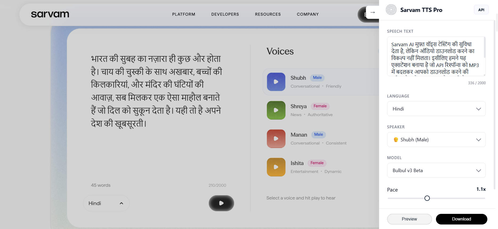

<p align="center">
  
  <h1 align="center">Sarvam TTS Pro</h1>
</p>

<p align="center">
  
</p>

A premium, tech-minimalist browser extension for **Sarvam AI** that enhances the Text-to-Speech experience by enabling high-quality audio previewing and direct MP3 downloads.

## 🌟 Key Features

- **Direct MP3 Downloads**: Convert Sarvam's TTS API responses directly into downloadable MP3 files.
- **Instant Preview**: Built-in audio player to listen to generated speech before downloading.
- **Premium Multi-Selects**: Custom, sleek dropdowns for selecting Speakers and Models with gender icons.
- **Language Support**: Seamlessly toggle between 11 Indian languages (Hindi, English, Bengali, Tamil, etc.).
- **Fine-tuned Controls**: Real-time adjustment of **Pace** and **Temperature** for perfect speech synthesis.
- **Smart Shortcut**: One-click from the browser toolbar opens the Sarvam TTS playground and auto-launches the sidebar.
- **Tech-Minimalist Design**: A beautiful, light-themed sidebar that integrates seamlessly into the Sarvam AI dashboard.

## 🛠️ Tech Stack

- **Framework**: [WXT](https://wxt.dev/) (Web Extension Toolbox)
- **Frontend**: React + TypeScript
- **Styling**: Vanilla CSS (Premium Light/Indigo Theme)
- **API**: Internal Sarvam AI TTS Playground API

## 🚀 Getting Started

### Prerequisites
- Node.js (v18 or higher)
- npm or pnpm

### Installation
1. Clone the repository.
2. Install dependencies:
   ```bash
   npm install
   ```

### Development
Start the development server for your preferred browser:
```bash
# Chrome (Default)
npm run dev

# Firefox
npm run dev:firefox

# Edge
npm run dev:edge
```

### Production Build & Packaging
Generate production builds or ready-to-upload zip files:

| Target | Build Command | Zip Command |
| :--- | :--- | :--- |
| **All Browsers** | `npm run build:all` | `npm run zip:all` |
| **Chrome** | `npm run build` | `npm run zip` |
| **Firefox** | `npm run build:firefox` | `npm run zip:firefox` |
| **Edge** | `npm run build:edge` | `npm run zip:edge` |

Final artifacts will be generated in the `.output/` directory.

## 📝 Usage

1. **Smart Shortcut**: Click the **Sarvam TTS Pro** icon in your browser toolbar. It will automatically open the Sarvam AI website and launch the sidebar for you.
2. **Manual Open**: You can also manually visit [Sarvam AI Text-to-Speech](https://www.sarvam.ai/apis/text-to-speech) and click the extension icon to toggle the tools.
3. **API Pricing**: Look for the **API** button in the top-right corner of the sidebar to quickly check official pricing.
4. **Generate & Download**:
   - Enter your text (up to 2000 characters).
   - Select your preferred Language, Speaker, and Model.
   - Click **Preview** to listen or **Download** to save the MP3.

## ⚖️ License
This project is for educational and personal use. All rights to the TTS models belong to Sarvam AI.
